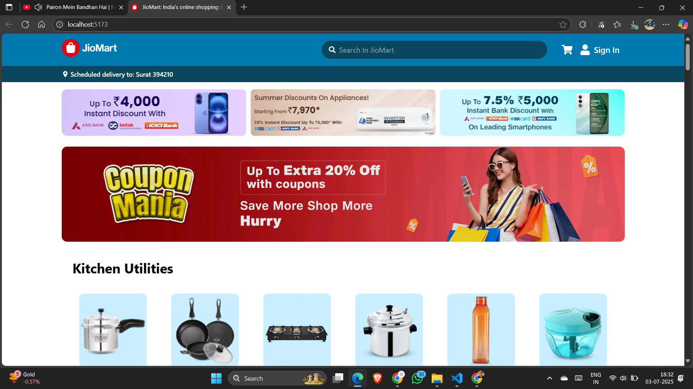
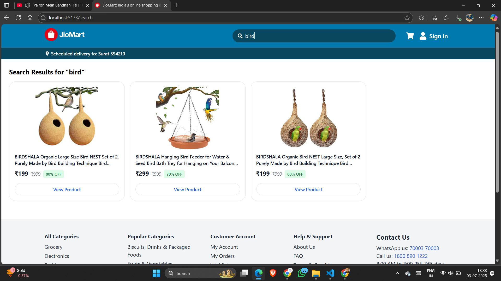
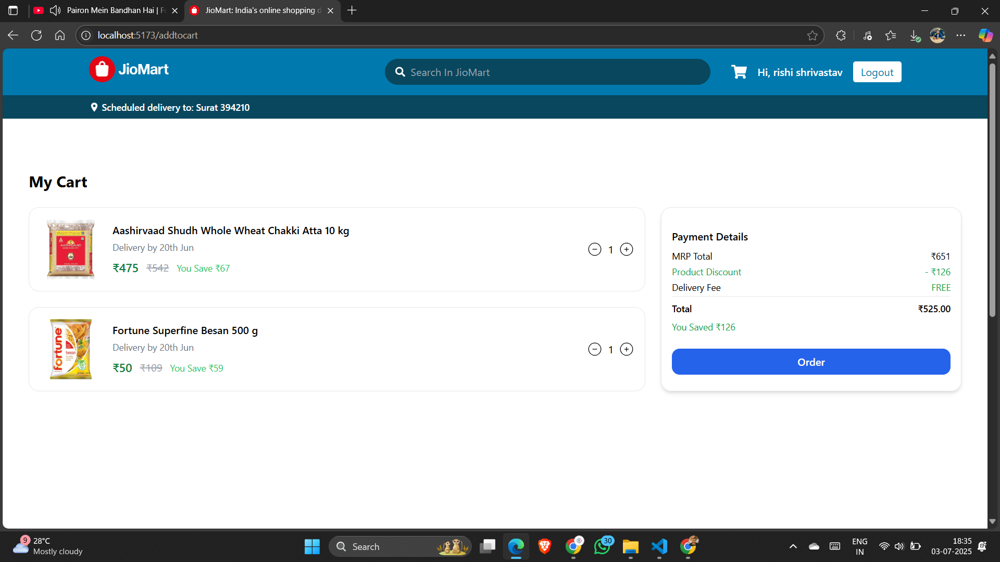
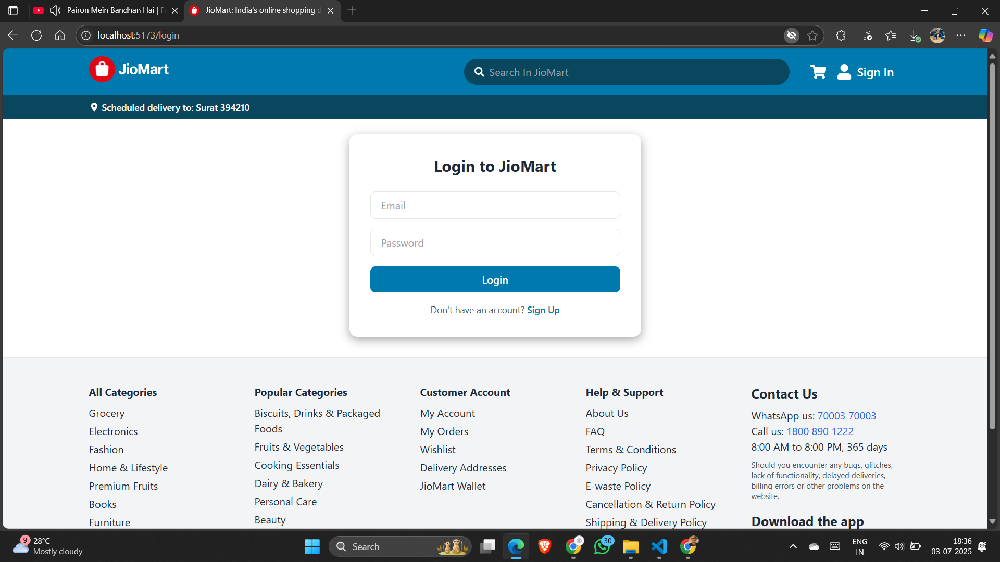
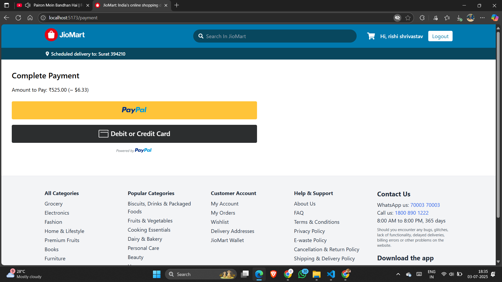

# 🛒 JioMart Clone

A fully functional **JioMart e-commerce web application** built with **React.js**, **Tailwind CSS**, and **Redux**. This clone replicates key features of the JioMart shopping experience including category-based navigation, dynamic product search, cart, and integrated **PayPal Checkout**.

---

## 🚀 Features

- 🗂️ Category-wise Product Browsing (Grocery, Fashion, Electronics, etc.)
- 🔍 Real-time Search from Navbar
- 📄 Product Detail Pages with Ratings, Discounts, and Offers
- ➕ Add to Cart / ➖ Remove from Cart
- 🔁 Quantity Updates & Cart Summary
- 💳 **PayPal Integration** for Payments
- 🔗 React Router for Seamless Navigation
- 🌐 API Integration using Axios
- 🎯 Global State Management with Redux
- ⚡ Styled using Tailwind CSS

> ⚠️ *Note: This project is responsive and optimized for both desktop and mobile.*

---

## 🛠️ Tech Stack

| Technology      | Description                             |
|-----------------|-----------------------------------------|
| React.js        | UI Library                              |
| Tailwind CSS    | Utility-first CSS Framework             |
| Redux           | Global State Management                 |
| Axios           | HTTP Client for API Requests            |
| React Router    | Client-side Routing                     |
| PayPal JS SDK   | Integrated Payment Gateway              |

---

## 🧩 Getting Started

### 1️⃣ Clone the Repository

```bash
git clone https://github.com/KFS-developer/Jiomart_Clone.git
```

### 2️⃣ Install Dependencies

```bash
npm install
```

### 3️⃣ Start React App

```bash
npm run dev
```

---

# 💳 PayPal Integration

- Ensure you have a PayPal Developer Account
- Add your Client ID in the environment or directly in the PayPal script tag.
- Test using Sandbox PayPal Accounts

---

## 🌄 Screenshots

| Home Page | Product Search | Add-to-cart |
|-----------|----------------|-------------|
|  |  | |

| Product Page | Login Page | Checkout Page |
|--------------|------------|---------------|
|  |  | |

---

## 🌐 Live Demo

🛍️ Try the Live App(Frontend): [Visit Live Site](https://jiomart-clone-kp.vercel.app/)

✅ You can **create your own account** using the Sign Up page.  
Or use this **test account** to explore instantly:

- **Email:** `shivam@gmail.com`
- **Password:** `123456`

> 🧪 Note: The test account is public. Avoid entering any sensitive data.

⚙️ Backend API: [Visit Live API](https://jiomart-clone-data-json.onrender.com/)

> Make sure the backend (e.g., Render or Railway) is active for full functionality like product data, login, and cart management.
> Free services like Render or Railway may take a few seconds to wake up if idle.

---

## 👤 Author

**Patel Ketul**  

---

## 📃 License

Licensed under the [MIT License](LICENSE)

> ⭐ If you liked this project, please consider starring it on GitHub!
